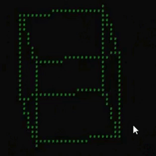

# 3D on the console

It is just for fun. :joystick:

This program can create 3D objects on the console (line, cube, and custom object).

Unfortunately, it only supports orthographics for now and doesn't support perspective.


*video:*




## run on linux
First download the file.
```
wget https://raw.githubusercontent.com/Hosein-Zarei2/console-3d/main/Program.cs
```
Give it premission to run.
```
sudo chmod a+x Program.cs
```

Install mono-complete
```
sudo apt update && sudo apt upgrade
sudo apt install mono-complete
```
Compile the program
```
sudo mcs Program.cs
```
Run it! :video_game:
```
sudo mono Program.exe
```
Use the arrow keys to rotate. :arrow_left: :arrow_right: :arrow_down: :arrow_up:

Use $\textcolor{yellow}{A}$ and $\textcolor{yellow}{D}$ to move it left and right.

Press $\textcolor{red}{Q}$ to quit the program.


## main code
```c#
Window win = new Window(35, 36);
World3D world = new World3D(1/*total objects*/, new Vector3(35, 36, 36)/*world size*/);

/*backgRound*/
E.empty = " ";

//create object

// "cube" , "line" , "custom"
Object o1 = new Object("cube");
o1.rotationPoint = new Vector3(10,10,10);
o1.fill = "#";
o1.sortRotate[0] = "Y";//first 
o1.sortRotate[1] = "X";//second
o1.sortRotate[2] = "Z";//third
o1.position = new Vector3(7, 8, 8);
o1.rotation = new Vector3(0, 0, 0);
o1.scale.x = 21;
o1.scale.y = 21;
o1.scale.z = 21;


world.add(o1, 0);
OrthographicCamera cam = new OrthographicCamera(world, win);
cam.position = new Vector3(0, 0, 0);

while (true)
{

    world.update();
    cam.update();
    win.show(cam);
    Thread.Sleep(50);
    System.Console.Clear();
    o1.rotation.y += 5;

}
```


## Description of classes

```c#

class window
{
  Gets 2d array from class OrthographicCamera{}.
  Prints the 2d array on screen.
}

class OrthographicCamera
{
    Pass objects and some information to class Converter{}.
    Then returns 2d array.
}

class World3D
{
    Creates a 3d array.
    Objects will be created by calling methods which are in class Object{}.
    Adds objects to 3d array.
}

class Object
{
    Creates objects and rotates them by class Math2{}.
    Then adds objects to 3d array.
}

class Converter
{
    Converts 3d array to 2d array.
    Connverter does not support perspective.
}

class Math2
{
    Rotates positions of objects one by one.
}
```

Make me bilionare :moneybag:

My ton address: (TON)
```
UQBIoYcaQTX7gBeuPQHlVL6KaNTQGXgKBICkGk9fqOCRLX4b
```
