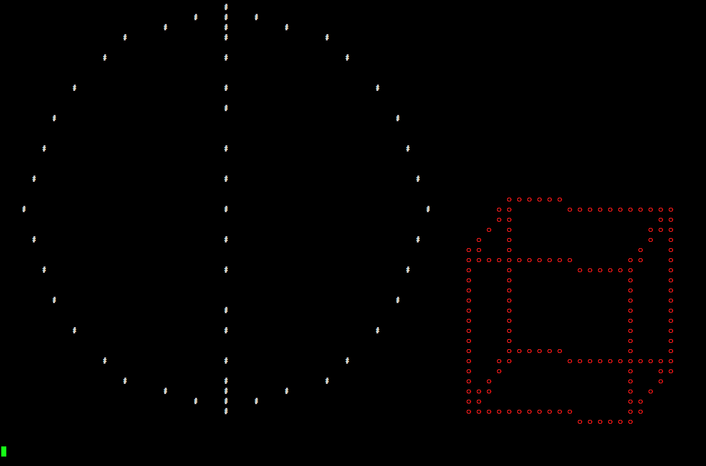

# 3D in the console

It is just for fun. :joystick:

This program can create 3D objects in the console (line, cube, sphere, and custom object).

Unfortunately, it only supports orthographics for now and doesn't support perspective.
<br/>

*pictures:*




<br/>

## run on linux
First download the file.
```
wget https://raw.githubusercontent.com/hossein-zarei/console-3d/main/Program.cs
```

Install mono-complete
```
sudo apt update && sudo apt upgrade
sudo apt install mono-complete
```
Compile the program
```
mcs Program.cs
```
Run it! :video_game:
```
mono Program.exe
```
Use the arrow keys to rotate. :arrow_left: :arrow_right: :arrow_down: :arrow_up:

Use $\textcolor{yellow}{A}$, $\textcolor{yellow}{D}$, $\textcolor{yellow}{W}$ and $\textcolor{yellow}{S}$ to move it left, right, up and down.

Use $\textcolor{yellow}{E}$ to switch betweeen objects.

Press $\textcolor{red}{Q}$ to quit the program.


## main code
```c#
    public static void Main(String[] args)
    {

        // (window & world)***
        Window win = new Window(35, 36);
        World3D world = new World3D(2/*total objects*/, new Vector3(35, 36, 36)/*world size*/);
        

        /*backgRound & color*/
        E.empty = " ";
        win.COLORS["#"] = ConsoleColor.Red;
        win.COLORS["o"] = ConsoleColor.Blue;


        //(objects)***

        // "cube", "line", "sphere", "custom"
        Object o1 = new Object("cube");
        o1.rotationPoint = new Vector3(10,10,10);//It will rotate around this position.
        o1.fill = "#";
        //(sortRotate) 
        o1.sortRotate[0] = "Y";//first 
        o1.sortRotate[1] = "X";//second
        o1.sortRotate[2] = "Z";//third
        o1.position = new Vector3(5, 5, 8);
        o1.rotation = new Vector3(0, 0, 0);
        o1.scale.x = 21;
        o1.scale.y = 21;
        o1.scale.z = 21;
	  
        Object o2 = new Object("line");
        o2.rotat...
        

        /*custom_object.customPoints = new Vector3[1];
        custom_object.customPoints[0] = new Vector3(0, 0, 0);*/


        //(add objects to world)***
        world.add(o1, 0);
        world.add(o2, 1);


        //(Orthographic Camera)***
        OrthographicCamera cam = new OrthographicCamera(world, win);
        cam.position = new Vector3(0, 0, 0);

		

        //(show in window)***
        while (true)
        {
            System.Console.Clear();
            world.update();
            cam.update();
            win.show(cam);

            switch ( Console.ReadKey().Key )
            {
                case ConsoleKey.LeftArrow:
                    o1.rotation.y += 5;
                break;
                case Conso...
            }

        }

    }

    
```
<br/>
<details>
<summary>Description of classes</summary>
<br/>
    
```c#

class window
{
  Gets 2d array from class OrthographicCamera{}.
  Prints the 2d array on screen.
}

class OrthographicCamera
{
    Pass objects and some information to class Converter{}.
    Then returns 2d array.
}

class World3D
{
    Creates a 3d array.
    Objects will be created by calling methods which are in class Object{}.
    Adds objects to 3d array.
}

class Object
{
    Creates objects and rotates them by class Math2{}.
    Then adds objects to 3d array.
}

class Converter
{
    Converts 3d array to 2d array.
    Connverter does not support perspective.
}

class Math2
{
    Rotates positions of objects one by one.
}
```
</details>
<br/>

